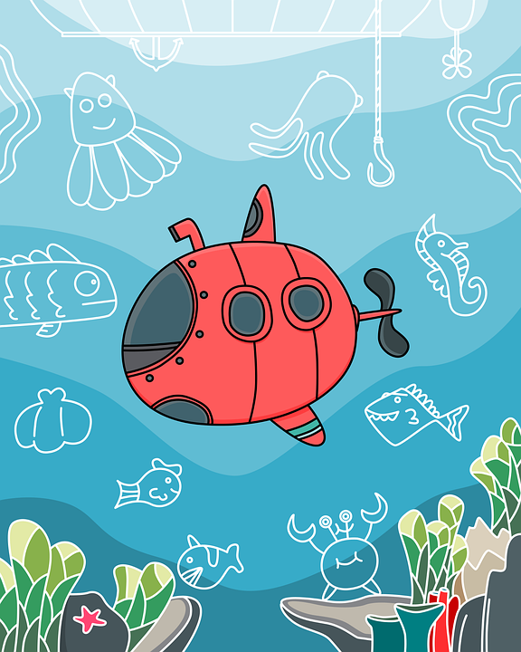

Wir sind in der 4. Schulwoche der Corona-Schließungen. Als Lehrer sieht man zur Zeit, warum man Lehrer geworden ist: Umgang mit Menschen, persönlicher Kontakt, …   - Doch all das fehlt zur Zeit.

Es gibt ja sehr unterschiedliche Arten von Kommunikation: Kommunikation in der Fachschaft, im Kollegium, in Arbeitsgruppen, zwischen Schulleitung und Lehrern, zwischen Schulleitung und Eltern, zwischen Schülern und Schülern, zwischen Lehrern und Schülern,….

Viele dieser Kommunikationswege sind zur Zeit gestört, was im schlimmsten Fall bedeutet:

>  Schule fühlt sich [für Lehrer | Eltern | Schüler] wie ein **U-Boot** an.

Im U-Boot erledigen [Schüler | Eltern | Lehrer] ihre jeweiligen Aufgaben. Lehrer stellen Arbeitsaufträge, Schüler bearbeiten Arbeitsaufträge, Eltern unterstützen ihre Kinder. Das Uboot funktioniert (im besten Fall).

Was aber fehlt?

Das U-Boot weiß nicht wie es außerhalb läuft. Das U-Boot im Krieg weiß z.B. nicht, ob es “draußen” gut läuft, schlecht läuft. Wenn man nicht weiß, was andere machen, dann führt man einen einsamen Kampf ohne Perspektive darauf ob dieser erfolgreich verläuft. 

### Agilität

Wenn man sich diese Kernpunkte anschaut, dann erinnert vieles daran an den Gedanken der **Agilität**. Agilität ist ein Mindset (festgehalten im [agilen Manifesto](https://agilemanifesto.org/)) mit dem Handeln unter Bedingungen der Komplexität und Ungewissheit möglich wird. Als **agile Entwicklung** ist dies insbesondere in der Informatik ein Konzept, es gibt aber auch einige Ansätze dies in den Bildungskontext zu übertragen.

Die Grund-Metapher von **agiler Entwicklung** ist die: Anstelle eines **Plans** aufzustellen, der über viele Monate hinweg befolgt werden soll, schlüpft man in die Rolle eines **Fahrers**, setzt sich kurze Ziele (z.B. wie komme ich um die nächste Kurve) und reduziert die Komplexität auf den Zeitraum der überschaubar ist. 

Damit dies funktioniert, ist Kommunikation und Feedback unumgänglich.

Dies wird anhand eines konkreten Prozessmodells klar, ich stelle dafür kurz einige Grundlagen von SCRUM vor (allerdings sehr reduziert und vereinfacht. Die Projektmanager mögen mir dies verzeihen)

Scrum ist ein Prozessmodell aus der agilen Entwicklung. Der Begriff Scrum ist kein Acronym, sondern beschreibt den Prozess beim Football/Rugby, wenn die Spieler ihren Plan für den nächsten Spielzug besprechen. 

Es gibt immer eine **Planungsphase**, in der man entscheidet welche Elemente des allg. Product-Backlogs im kommenden **Sprint** erledigt werden. Wichtig ist, dass diese Planung vor allem vom **Team** voran getrieben wird. In der agilen Entwicklung wird auf starre Hierarchien verzichtet und das Team entscheidet (unter Anleitung des Scrum Masters, in Absprache mit dem Product Owner) den Fahrplan für die kommende Zeit.

Der Sprint ist nun die Phase in der gearbeitet wird. Teil des Sprints sind tägliche Meetings. Die agile Entwicklung kennt verschiedenste Methoden die dafür sorgen sollen, dass nicht jeder in seinem stillen Kämmerchen an seinem Problem arbeitet, sondern das dem Team bewusst ist, wo genau im Prozess sie sich befinden.  In Scrum wird der Prozess z.B. anhand eines Whiteboards mit Post-Its visualisiert.

Am Ende des Sprints folgt eine **Retrospektive** in der evaluiert, was gut und was schlecht funktioniert hat und was im nächsten Sprint verbessert werden kann.

### Agilität vs, Schule als U-Boot

Wenn man sich dies anschaut wird (zumindest für mich) klar, dass Agilität an dieser Stelle das oberste Gebot für alle Prozesse und Handlungen sein sollte. Man braucht dafür kein Prozessmodell studieren. Es reicht, wenn man sich auf wenige Grundprinzipien konzentriert:

* Das Team einbinden.
* Den Prozess sichtbar machen.
* Regelmäßiges Feedback einholen und zur Prozessoptimierung nutzen.

Wenn man diese 3 Prinzipien beachtet, könnte man entgegenwirken, dass Schule wie ein U-Boot wahrgenommen wird.

Bildquelle Scrum: https://de.wikipedia.org/wiki/Datei:Scrum_process-de.svg

